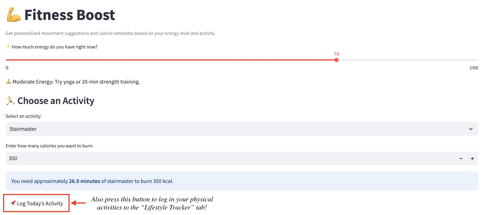

# 🌿 ThriveHub: Your Personal Wellness Companion

Welcome to ThriveHub! This all-in-one wellness app helps you track nutrition, log moods, manage physical activity, and reflect on your lifestyle using interactive dashboards — all powered by [Streamlit](https://streamlit.io/), [Altair](https://altair-viz.github.io/), and the [Nutritionix API](https://developer.nutritionix.com/).

🔗 **Live App**: [https://lee-nutritionist.streamlit.app/](https://lee-nutritionist.streamlit.app/)

---

## 📌 Project Overview

Being self-aware of one's wellness is important to living a more fulfilling and balanced life. In order to highlight the importance of taking proactive steps to care for one's wellness, ThriveHub was designed to empower users to:
- Log meals and analyze nutrition in real time  
- Track moods and energy throughout the day  
- Estimate calories burned from fitness activities  
- Reflect on patterns via interactive charts and logs

Whether you're a student, a working professional, or someone looking to improve your daily habits, ThriveHub brings together everything in one intuitive dashboard.

---

## 💡 Installation & Local Setup

To run ThriveHub locally:

### 1. Clone the repository
```bash
git clone https://github.com/NDylee34/StreamlitAppFinal.git
cd StreamlitAppFinal
````

### 2. Create a virtual environment (optional but recommended)
```bash
python -m venv venv
source venv/bin/activate   # On Windows: venv\Scripts\activate
```

### 3. Install required packages
```bash
pip install -r requirements.txt
```

### 4. Launch the app
```bash
streamlit run main.py
```

---

## 🚀 App Features

### 🧍 Profile Setup

Set your age, height, weight, gender, wellness goal, and activity level. These are used across nutrition and fitness calculations.


### 🥗 Nutrition Tracker

* Analyze food items using the Nutritionix API
* Choose between uploading a CSV or manual entry
* View calorie and macro breakdown
* Visualize intake with an interactive donut chart


### 🧠 Mood & Mind

* Log how you're feeling and your current energy level
* Get curated Spotify playlists based on your mood
* Receive motivational quotes for your mental boost
* Visualize energy trends over time


### 💪 Fitness Boost

* Select an activity and target calorie burn
* Get personalized estimates of required duration
* Log activity entries with energy, time, and calories
* View your recent activity history




### 📈 Lifestyle Tracker

* View logged mood & fitness data across time
* Interactive Altair charts
* Summary table of workouts with energy, duration, and calories burned


---

## 📚 References & Resources

* [Streamlit Community](https://streamlit.io/gallery)
* [Nutritionix API](https://developer.nutritionix.com/)
* [Altair Visualization Library](https://altair-viz.github.io/)
* [Pandas](https://pandas.pydata.org/)

---

## 📬 Feedback

Have ideas to improve ThriveHub?
Feel free to fork the project, open issues, or submit pull requests!